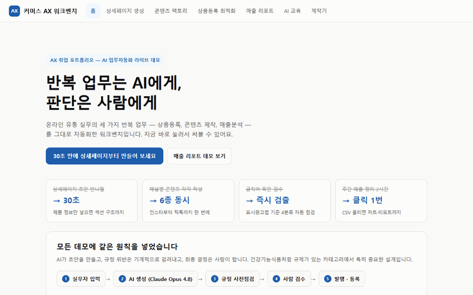

# 커머스 AX 워크벤치

**라이브 데모: https://ax-workbench.pages.dev**



온라인 유통 실무(상품등록·콘텐츠 제작·매출분석)를 AI로 자동화한 워크벤치입니다.
상품 정보를 넣으면 상세페이지·채널 콘텐츠·등록 문구를 만들고, 표시광고 금칙어를 사전 점검한 뒤
오픈마켓 4개 채널의 등록 규정에 맞춰 자동 교정해 등록용 CSV와 매출 리포트까지 내보냅니다.

설계 원칙은 하나입니다 — **AI가 초안을 만들고, 규정 위반은 기계적으로 걸러내고, 최종 결정은 사람이 한다.**
표시광고 규제가 있는 카테고리에서는 "그럴듯한 문구"보다 "내보내도 되는 문구"인지가 먼저이기 때문입니다.

## 기능 구성

| 경로 | 기능 | 다루는 실무 |
|---|---|---|
| `/detail-page` | AI 상품 상세페이지 생성기 (HTML 다운로드 → 디자이너 인계) | 콘텐츠 제작 |
| `/content` | 채널 콘텐츠 팩토리 (인스타·카드뉴스·블로그·스레드·유튜브·틱톡) | 콘텐츠 제작 |
| `/listing` | 상품등록·검색어 최적화 + 표시광고 금칙어 사전점검 | 상품 등록 |
| `/batch` | 엑셀·CSV 업로드로 상품 20개 일괄 등록 (5개씩 병렬) | 상품 등록 |
| `/channels` | 오픈마켓 4개 채널 등록 규정 판정·자동 교정 + 등록 양식 CSV | 상품 등록 |
| `/sales` | 매출 CSV 자동 집계·차트 + AI 주간 리포트 | 매출 분석 |
| `/edu` | 직원 AI 교육 가이드 | 사내 확산 |

## 기술 스택

- React 19 + Vite, Cloudflare Pages Functions
- Claude API (`claude-opus-5`) — tool 강제 호출로 구조화 JSON 응답
- Cloudflare D1 — API 레이트리밋
- 판매 CSV는 브라우저에서만 파싱 (서버 미전송)

## 실행

```bash
npm install
npm run dev        # 프론트만 (API는 프록시)
npm run dev:full   # wrangler pages dev 포함
npm test           # vitest
npm run build
```

## 배포 (Cloudflare Pages)

wrangler CLI로 배포하되, wrangler.toml은 두지 않습니다 — 파일이 있으면 Cloudflare가
변수·바인딩을 "wrangler.toml 관리 모드"로 잠가 대시보드에서 시크릿을 추가할 수 없기 때문입니다.

```bash
npm run build
npx wrangler pages deploy dist --project-name ax-workbench --branch master
npx wrangler d1 migrations apply ax-workbench --remote   # 최초 1회 (레이트리밋 테이블)
```

`.github/workflows/deploy.yml`이 같은 명령을 Actions에서 실행합니다. 현재는 수동 실행 전용이며,
자동 배포로 켜려면 저장소 시크릿 `CLOUDFLARE_API_TOKEN`·`CLOUDFLARE_ACCOUNT_ID` 등록이 필요합니다.

### 라이브 AI 전환 (대시보드에서 등록)

기본 상태에서는 큐레이션된 샘플 응답(데모 모드)으로 전체 흐름을 시연합니다.

1. Cloudflare 대시보드 → Workers & Pages → **ax-workbench** → Settings → **Variables and secrets** → **+ Add**
2. Type **Secret**, 이름 `CLAUDE_API_KEY`, 값에 API 키 입력 → 저장
3. **Bindings**에 D1 바인딩(변수명 `DB`, 데이터베이스 `ax-workbench`)이 있는지 확인, 없으면 + Add로 추가
4. 재배포(또는 다음 배포)부터 같은 화면이 Claude Opus 5 라이브 생성으로 전환됩니다

## 문서

- [개선기획안.md](./개선기획안.md) — 배포 후 개선 사이클 기록 (벤치마킹 → 진단 → 구현 → 실측)
